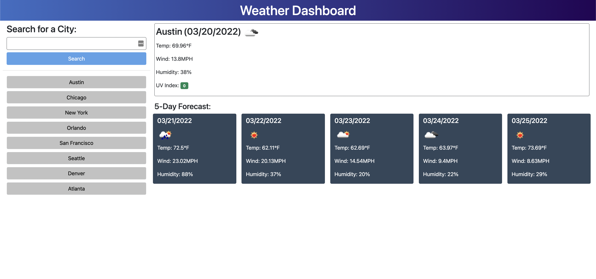

# Weather Dashboard

[https://mannygarcia98.github.io/weather-dashboard/](https://mannygarcia98.github.io/weather-dashboard/)

Weather Dashboard is a web app for getting the current weather and a 5 day forecast. Once the user searches a city, it will load the weather for that city on their next visit for convenience.

## Technical

The site uses a combination of 2 APIs from Open Weather Map. The first (Curent Weather Data) was used to geolocate a city based on a user's input. The latitude and longitude are passed to the next API (One Call).

## Screenshot

The following image shows the web application's appearance and functionality.

